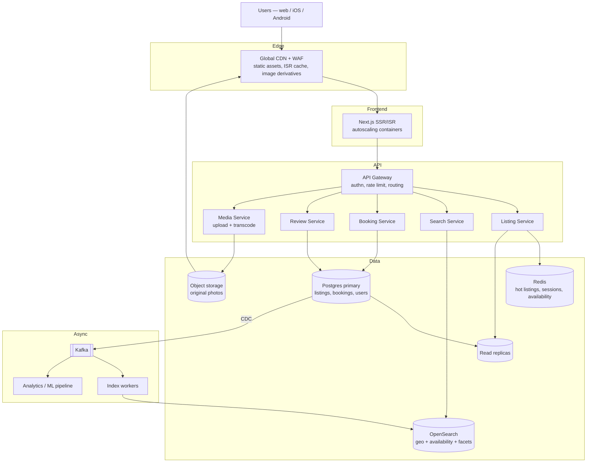

# Architecture

## 1. Tech stack

| Layer | Choice | Why |
|---|---|---|
| Frontend | Next.js (App Router, TypeScript, RSC) | Required by the task; RSC keeps the listing page server-rendered and fast |
| Backend | Express + TypeScript (`apps/api`) | Required "Node.js" backend, kept as a real separate service |
| Styling | Tailwind v4 `@theme` tokens | Token values come straight from `DESIGN.md`; utilities keep spacing/type consistent |
| Motion | Framer Motion | Overlay enter/exit + shared-element transitions; respects `prefers-reduced-motion` |
| Icons | Hand-rolled SVG | Airbnb's 32-glyph illustrated set has no icon-pack equivalent |
| Testing | Vitest (unit) + Playwright (e2e, a11y, visual) | Playwright is also the only way to inspect the bot-protected reference |
| Repo | npm workspaces | Two apps, one lockfile, one `npm run dev` |
| Deploy | Vercel (web) + Render/Fly (api) | Matches the reference's hosting; API gets a long-lived container |

## 2. App flow

```
Browser ──GET /──► Next.js RSC page
                      │
                      └──fetch GET /api/listings/:id──► Express (apps/api)
                                                          └── listing.json
                      ◄── HTML (fully rendered listing) ──┘

Click "Show all photos"  ──► router.push('?photos=1')      ──► PhotoTour overlay (client)
Click a photo in tour    ──► router.push('?photos=1&i=3')  ──► Lightbox overlay (client)
ESC / Back               ──► router.back()                 ──► previous layer restored
```

**Overlay state lives in the URL, not in React state.** Consequences that matter:

- Photo Tour and Lightbox are deep-linkable and shareable.
- Browser Back closes one layer at a time — no history trap.
- The listing page underneath never unmounts, so scroll position survives close.

Data fetching happens **once, server-side**. The client bundle carries interaction code only: overlays, calendar, guest stepper, "show more" modals.

## 3. Folder structure

```
apps/
  web/
    src/
      app/
        layout.tsx           # fonts, <html>, global styles
        page.tsx             # RSC — fetches listing, renders sections
      components/
        listing/             # Nav, HeroGrid, TitleRow, RatingCard, Amenities,
                             # Calendar, Reviews, ReservationCard, Footer
        gallery/             # PhotoTour, Lightbox, useOverlayRoute, useFocusTrap
        ui/                  # Button, Modal, Badge, Icon, Avatar
      styles/
        tokens.css           # @theme block generated from DESIGN.md
        globals.css          # reset + base type
      lib/
        api.ts               # fetch wrapper for the Express service
        types.ts             # Listing, Photo, Review, Amenity, Host
    public/photos/           # listing images (user-supplied)
  api/
    src/
      server.ts              # express app + cors + error handler
      routes/listings.ts     # GET /api/listings/:id
      data/listing.json      # seed listing (user-supplied)
      types.ts               # re-exported shape shared with web
```

No `utils/`, no `hooks/` barrel, no `constants/` — add a directory only when a second file needs it.

## 4. Token pipeline

```
DESIGN.md  ──(manual, Phase 1)──►  apps/web/src/styles/tokens.css  ──►  Tailwind utilities
```

`tokens.css` mirrors the `colors`, `typography`, `rounded`, and `spacing` blocks of `DESIGN.md` as `@theme` custom properties. Components use `bg-primary`, `text-muted`, `rounded-md`, `p-lg` — never `#ff385c` or `14px`.

`DESIGN.md` is **read-only**. If a value is missing, measure it from the reference and add it to `tokens.css` with a comment naming the source, then flag it for a `DESIGN.md` update.

---

## 5. Production-scale architecture

The diagram below is the source of truth; redraw in Excalidraw for submission (`docs/architecture.excalidraw.png`).



### Scaling strategy

**Frontend.** Listing pages are read-dominated and change rarely — serve them via ISR with a short revalidate plus on-demand purge when a host edits. CDN absorbs the bulk of traffic; the Next.js tier autoscales on CPU and only handles cache misses and personalized fragments (saved state, price for the viewer's dates), which stream in after the shell.

**Backend.** Stateless services behind an API gateway, scaled independently — search and listing-read scale on traffic, booking scales on write throughput and needs the strictest consistency. Booking is the only service that writes reservations, so date-overlap conflicts resolve in one place via a transactional exclusion constraint in Postgres, not in application code.

**Storage.** Postgres primary for writes, read replicas for listing/review reads. Shard by listing region once a single primary saturates; bookings partition by check-in date. Redis fronts hot listings and availability windows — the cache is invalidated by CDC events, never by TTL alone, so a price change is never served stale.

**Search.** OpenSearch holds a denormalized listing document with geo point, amenity facets, and a compacted availability bitmap. Postgres CDC → Kafka → index workers keeps it eventually consistent, typically within seconds. Search never queries Postgres directly.

**Media.** Originals in object storage; the CDN generates and caches responsive AVIF/WebP derivatives at request time. The gallery ships a `srcset` per photo and an LQIP placeholder so Photo Tour opens without layout shift.

**Deployment.** Blue-green with automatic rollback on error-rate or p95-latency regression. Schema changes are expand/contract so a rollback never meets a table it cannot read. Feature flags gate risky UI. Observability: OpenTelemetry traces spanning CDN → Next.js → gateway → service → database, RED metrics per service, and alerts on booking-conversion drop rather than only on infrastructure health.
